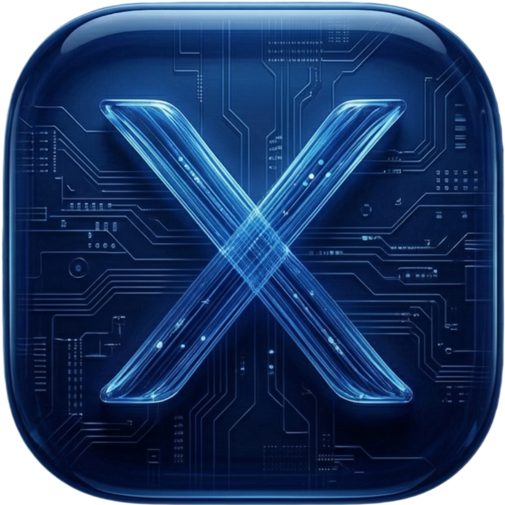

# xDB



**xDB** 是一款基于 Tauri v2 和 React 构建的现代化、极速、跨平台数据库管理枢纽。它旨在打破不同数据库之间的界限，为开发者提供一个全能（Cross-engine）且优雅的操控台。

## ✨ 核心特性

- **🌀 全能连接 (Cross-Engine Support)**
  - 🐬 **MySQL**: 完整的 CRUD 支持、结果集实时编辑、DDL 查看、事务管理。
  - 💾 **SQLite**: 极简的本地文件数据库连接、查询与结果展示。
  - 🔑 **Redis**: 键值对管理、多 DB 切换、TTL 修改、数据类型自动识别。
  - 🗄️ **Memcached**: 高效的缓存服务连接与基本操作。
- **📑 统一格式化器 (Universal Formatter)**
  - 内置强大的文本识别系统，支持 JSON, XML, PHP Serialize, HTML, Base64 等。
- **📟 指令回响 (Command Console)**
  - 实时监控每一条外发指令及其执行时长，让数据库交互透明化。
- **🎨 极致视觉 (Modern UI/UX)**
  - 基于 **shadcn/ui** 的高颜值界面，完美适配暗色模式。
- **⚡ 性能基因**
  - 后端由 **Rust** 驱动，极致轻量，秒级启动，跨平台支持 (Win/macOS/Linux)。

## 🛠️ 技术栈

- **前端**: React, TypeScript, Vite
- **后端**: Rust (Tauri v2)
- **状态**: Zustand
- **样式**: Tailwind CSS, shadcn/ui

## 🚀 快速开始

```bash
# 安装依赖
pnpm install

# 启动开发环境
pnpm tauri dev

# 构建生产包
pnpm tauri build