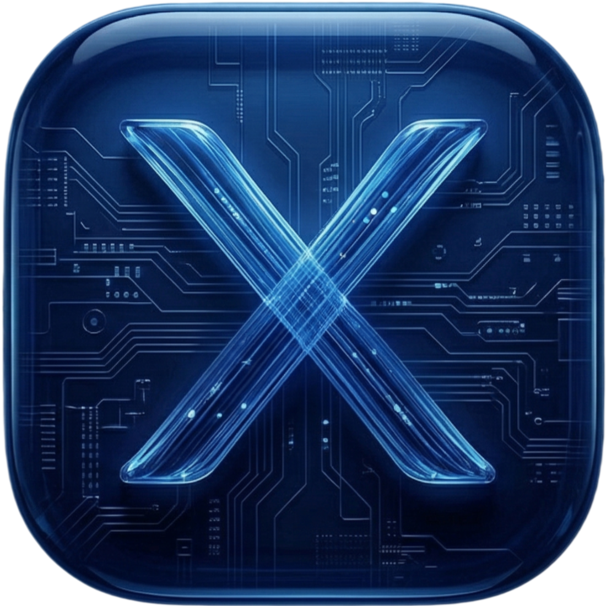

# xDB



[](https://github.com/cuigaoshun/xDB/releases)
[](LICENSE)
[](https://github.com/cuigaoshun/xDB)

[中文](./README_CN.md)

**xDB** is a modern, lightning-fast, cross-platform database management hub built with Tauri v2 and React. It aims to break down boundaries between different databases and provide developers with a comprehensive (Cross-engine) and elegant console.

## ✨ Features

- **🌀 Cross-Engine Support**
  - 🐬 **MySQL**: Full CRUD support, real-time result set editing, DDL viewing, transaction management, visual filter builder
  - 💾 **SQLite**: Minimalist local file database connection, query and result display
  - 🔑 **Redis**: Key-value management, multi-DB switching, TTL modification, automatic data type recognition (String/Set/List/Hash/ZSet)
  - 🗄️ **Memcached**: Efficient cache service connection and basic operations
- **📑 Universal Formatter**
  - Built-in powerful text recognition system, supporting one-click beautification of JSON, XML, PHP Serialize, HTML, Base64, SQL formats
- **📟 Command Console**
  - Real-time monitoring of every outgoing command and its execution time, making database interactions transparent
- **🔄 Connection Management**
  - Support for connection grouping management, connection import/export (JSON format)
- **🎨 Modern UI/UX**
  - Beautiful interface based on **shadcn/ui**, perfect dark mode support
  - Multi-tab switching, resizable panel layout
- **⚡ Performance**
  - Backend driven by **Rust**, extremely lightweight, second-level startup, cross-platform support (Win/macOS/Linux)
- **🔔 Auto Update**
  - Built-in auto-update mechanism to ensure you always use the latest version
- **🌐 Multi-language Support**
  - Supports Chinese/English interface switching, freely switchable in settings

## 🛠️ Tech Stack

| Layer | Technology |
|-------|------------|
| Frontend | React 19, TypeScript, Vite 7 |
| Backend | Rust (Tauri v2) |
| State | Zustand |
| UI | Tailwind CSS, shadcn/ui, Radix UI |
| Editor | Monaco Editor |
| Formatting | sql-formatter |

## 🚀 Quick Start

### Prerequisites

- **Node.js** >= 20
- **pnpm** >= 8
- **Rust** >= 1.70

### Install Dependencies

```bash
pnpm install
```

### Start Development

```bash
pnpm tauri dev
```

### Build Production

```bash
pnpm tauri build
```

## ⚙️ Settings

| Setting | Description |
|---------|-------------|
| Redis SCAN Count | Number of keys scanned per SCAN operation, affects loading performance |
| MySQL Prefetch DB Count | Number of databases prefetched on initial load |
| Show System Databases | Whether to show system databases (e.g., mysql, information_schema) |

## 📄 License

This project is open source under the **GNU General Public License v3.0**.

[](https://www.gnu.org/licenses/gpl-3.0.html)

See [LICENSE](LICENSE) for details.

## 🙏 Acknowledgments

- [Tauri](https://tauri.app/) - Build cross-platform applications
- [shadcn/ui](https://ui.shadcn.com/) - Beautiful UI components
- [Radix UI](https://www.radix-ui.com/) - Unstyled UI components